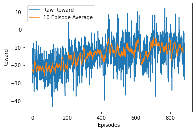
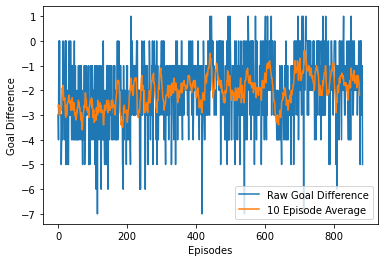
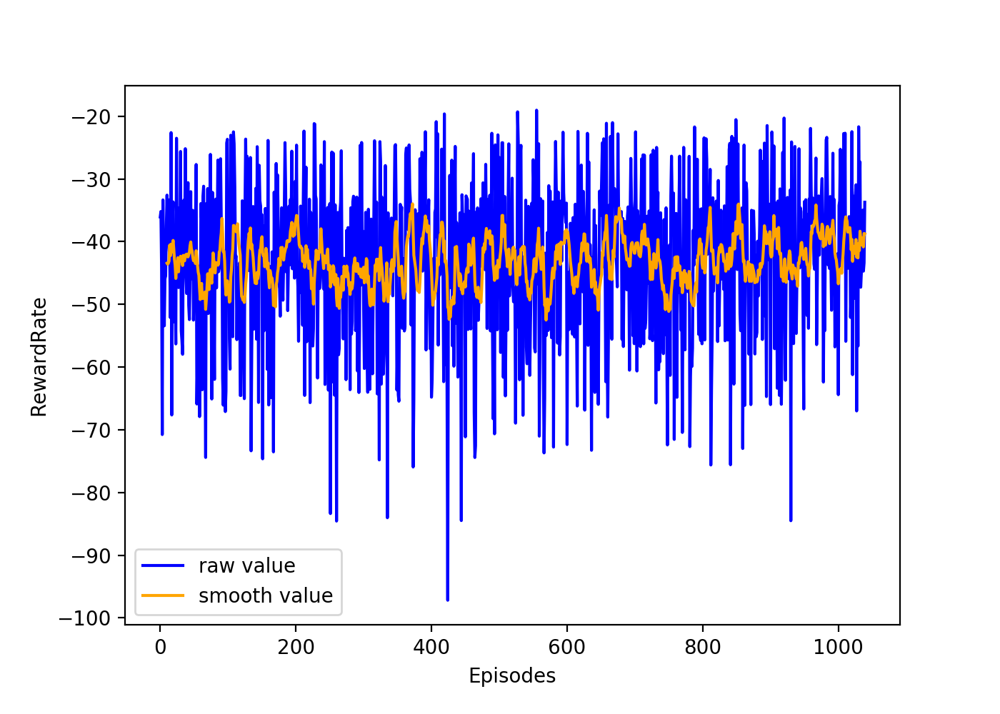
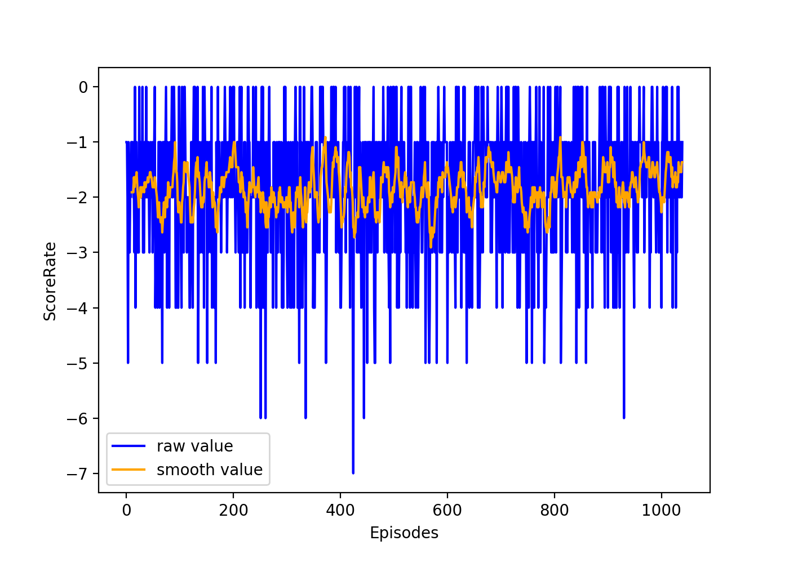

# Google Research Football 

## Dependencies
1. [google-research football](https://github.com/google-research/football)
2. PyTorch
3. tensorboardX
4. kaggle_environments

## Usage
```bash
python train_policy_grad.py 
# You can find args and hyper-parameters at the "arg_dict" in train.py. 
```

## training curves (vs rule base AI)

#### PPO Reward


#### PPO Score


#### Policy Reward


#### Policy Score

### Check following games between 
* [Policy vs Policy ](data/images/policy_vs_policy.webm)
* [Policy vs PPO Scratch](data/images/policy_vs_ppo_sc.webm)
* [Policy vs PPO Transfer Learning](data/images/policy_vs_ppo_ontop.webm)
